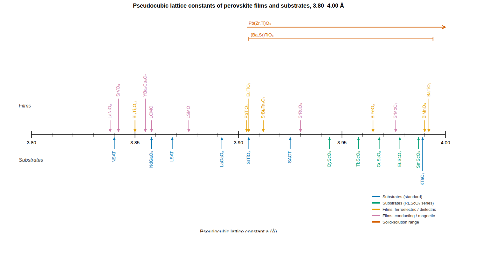

# Lattice-constant number line for PLD

A number-line visualization of room-temperature **pseudocubic lattice constants**
of perovskite substrates and film materials in the 3.80–4.00 Å window, in the
style of the classic figure from Schlom *et al.*, *Annu. Rev. Mater. Res.* **37**,
589 (2007). Substrates point up at the line from below; films point down from
above. Beyond the materials in the original figure, it adds PLD-relevant
conducting/magnetic oxides: LCMO, LSMO, LaNiO₃, SrRuO₃, SrVO₃, and SrMoO₃.

## Usage

```bash
pip install matplotlib numpy
python lattice_number_line.py     # writes lattice_number_line.png / .svg
```

Customize by editing the top of `lattice_number_line.py`:

- `RANGE` — the Å window to display (materials outside it are filtered out
  automatically; the dict already contains LaAlO₃, NdScO₃, and PrScO₃ for a
  wider window).
- `MATERIALS` — add a `Material(label, a, category, note)` entry; near-coincident
  entries are automatically staggered onto tiers so labels never collide.
- `RANGES` — solid-solution spans drawn as horizontal arrows (BST, PZT).
- `misfit(film_a, substrate_a)` — helper returning the biaxial misfit strain (%).

## Where the numbers come from (and why not Materials Project)

All values are **experimental** room-temperature pseudocubic lattice constants
from the crystal-growth and thin-film literature. For strain engineering, avoid
taking lattice constants from DFT databases (Materials Project, OQMD, AFLOW):
PBE/PBEsol-relaxed values carry ~0.5–1 % systematic error — 0.02–0.04 Å, larger
than the entire spacing between neighboring scandate substrates. Use those
databases to *look up structures*, then take the lattice constants from
experimental refinements (ICSD, Crystallography Open Database) or from:

- R. Uecker *et al.*, [*J. Cryst. Growth* **310**, 2649 (2008)](https://www.sciencedirect.com/science/article/abs/pii/S0022024808000675) — REScO₃ series (Nd–Dy)
- D. Klimm *et al.*, [*Cryst. Res. Technol.* **55**, 1900111 (2020)](https://onlinelibrary.wiley.com/doi/full/10.1002/crat.201900111) — REScO₃ substrate review
- D. G. Schlom *et al.*, [*Annu. Rev. Mater. Res.* **37**, 589 (2007)](https://www.annualreviews.org/doi/10.1146/annurev.matsci.37.061206.113016) — Table 1, commercial perovskite substrates
- [(Nd,Sr)(Al,Ta)O₃ (NSAT) structure, *Acta Cryst.* B (2026)](https://pmc.ncbi.nlm.nih.gov/articles/PMC13058900/)

Per-entry provenance notes live in the `MATERIALS` list in the script. Values
for solid solutions (NSAT, LSAT, LSMO, LCMO…) shift with exact composition;
the notes flag the spread where it matters.



*(Preview render; run the script for the full-resolution matplotlib figure.)*
